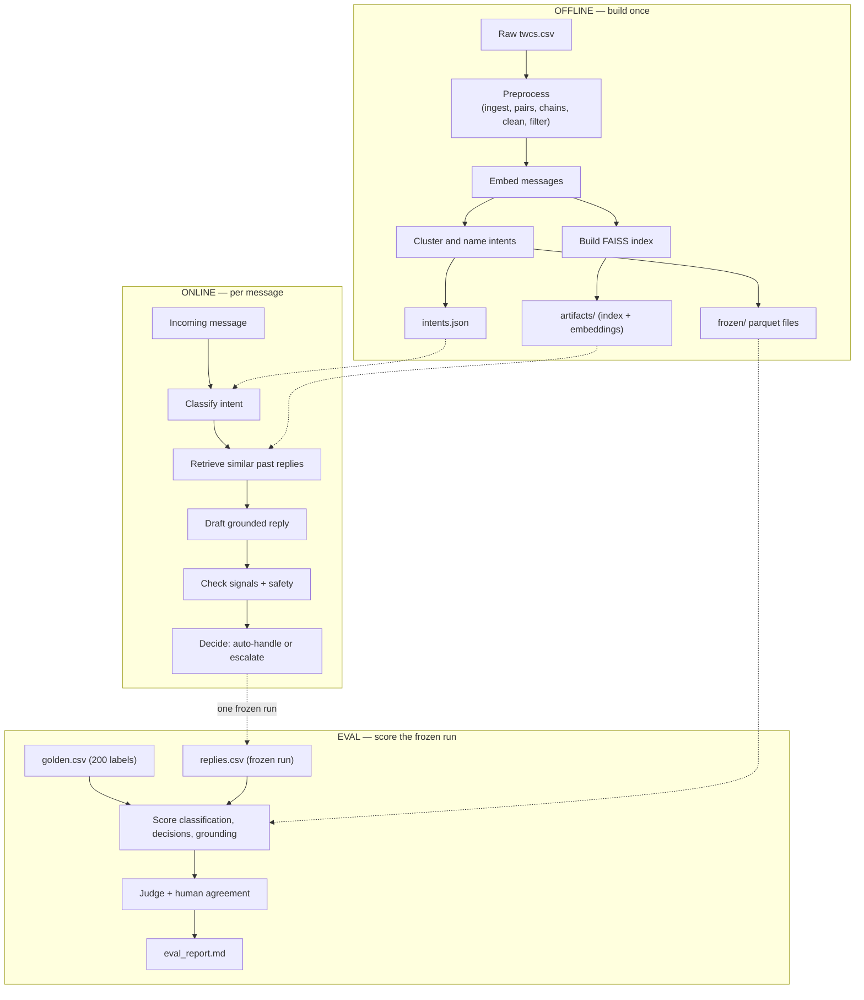

# support-agent

Twitter customer-support (`twcs`) triage pipeline over the AmazonHelp threads: classify
intent, retrieve similar past exchanges, draft a reply, and decide whether to auto-send
or escalate to a human — with an evaluation that says how often that decision was right.

Requires Python ≥3.11. The install below pulls in `faiss-cpu` and `sentence-transformers`
(which pulls torch) as core dependencies, so even the "few seconds, no artifacts" path
needs a real install to have already succeeded — there's no lighter dev-only extra yet.

## Reproduce the report

```
git clone <this repo> && cd support-agent
pip install -e ".[dev]"
make eval or python -m scripts.run_eval
```

That writes `results/eval_report.md` in a few seconds. **No API key, no dataset
download, no 500 MB of artifacts, no model to pull.** Everything `make eval` reads is
in the repo:

| file | what it is |
| --- | --- |
| `data/labels/golden.csv` | 200 messages, hand-labelled with intent and expected action |
| `results/replies.csv` | one frozen run of the agent over those 200 messages |
| `results/judge_scores.csv` | the LLM judge's five scores per reply, cached |
| `data/labels/human_scores.csv` | 50 of those replies, hand-scored against the same anchors |
| `results/reply_similarity.csv` | cached cosine similarity to each brand reply |
| `frozen/pair_clusters.parquet` | which cluster each retrieved pair belongs to (1.5 MB) |
| `config/intents.v2.json` | the taxonomy the golden set was labelled against |

To watch the pipeline itself run rather than read its scores:

```
make demo or python -m scripts.run_online --replay --limit 5
```

Five real messages through classify → retrieve → draft → signals → decide, from
recorded fixtures. Still no key and no index. It writes `results/demo_replies.csv` and
never touches the frozen run.

That's the whole reproduction path. Everything below is either background or a step
that produced the frozen files in the first place — **you do not need to run any of it,
and running some of it will invalidate the labelled set.**

## How it works



What each online stage actually does:

- **classify** (`online/classify.py`) — an LLM call assigns one intent from
  `config/intents.<version>.json`. A message the model can't fit to any listed intent
  is labelled `other`, and `other` escalates outright — it never reaches drafting.
- **retrieve** (`online/retrieve.py`) — embeds the message and searches the FAISS
  index built offline for the most similar past (customer message, Amazon reply)
  pairs, so the draft step has real precedent to work from rather than inventing one.
- **draft** (`online/draft.py`) — an LLM call writes a reply grounded in the retrieved
  pairs. `results/reply_similarity.csv` later measures how closely the reply actually
  tracks what it cited.
- **signals** (`online/signals.py`) — collects the inputs `decide.py` weighs beyond
  the reply itself. Repeat contact (the customer already got a reply earlier in this
  thread, via `data/processed/chains.parquet`) is one such signal, not a standalone
  automatic escalation trigger on its own.
- **safety** (`online/safety.py`) — a post-draft check independent of the model's own
  judgment: a reply containing a URL, an order number, or a tracking ID forces
  escalation, regardless of what `decide.py` would otherwise have chosen. This is the
  hard floor under the whole auto-handle path.
- **decide** (`online/decide.py`) — combines the intent, the signals, and the safety
  check into `auto-handle` or `escalate`, with a stated reason either way.

Offline and eval are one-way dependencies of this: offline produces the index and the
intents file that online reads, and eval only ever reads online's *frozen* output —
neither offline nor eval calls online, and online never imports from offline.

## What is frozen, and why

`results/replies.csv` is one run: one model, one date, one pass over the 200 golden
messages. `make eval` does not call the agent — it scores that file. So what you are
reproducing is the **scoring**, exactly, down to the last digit. You are not
reproducing the agent, and re-running it would not reproduce these numbers.

That is deliberate, for three reasons:

- **The model is nondeterministic.** A fresh run produces different replies, so every
  table would shift. Numbers computed off different runs cannot be read against each
  other, which is why the whole eval takes one frozen run as its input.
- **A re-run silently invalidates the hand-scored set.** `human_scores.csv` is 50
  replies scored by hand. Score a *different* 50 replies against it and the
  inter-rater κ is measuring nothing.
- **A rebuild invalidates the labels themselves.** `make offline` re-clusters the
  corpus, and cluster identity is not stable across runs. The intents in `golden.csv`
  are names from `config/intents.v2.json`, which came from *those* clusters. Rebuild
  and the labels describe a taxonomy that no longer exists.

What makes the frozen run worth trusting is not that you can re-roll it. It is the
audit trail around it: the 200 rows were labelled from message text alone, never
looking at the brand's real reply (see `data/labels/LABELLING.md` for the exact
protocol); 50 replies were hand-scored blind against the same anchors the LLM judge
was given; and the report states Cohen's κ between the two, along with the
denominator under every rate it prints.

## Reading the report

`results/eval_report.md` has five parts, in the order `report.py` assembles them:

- **Classification** — per-intent precision/recall/F1 against `golden.csv`
  (`eval/classification.py`), so a weak intent shows up by name, not just as a dip in
  an overall number.
- **Decisions** — auto-handle vs. escalate scored with escalate as the positive class
  (`eval/decisions.py`), plus a breakdown of *why* each escalation fired (intent
  `other`, safety trigger, or the model's own call).
- **Grounding** — how well each reply matches what it cited, from
  `results/reply_similarity.csv` scored by `eval/retrieval.py`. This is the frozen
  run's own citations; `make eval-live` (below) scores retrieval fresh from the index
  instead, and the report labels which one produced its numbers.
- **Judge agreement** — the LLM judge's five 1–5 scores per reply
  (`results/judge_scores.csv`) against the 50 hand-scored replies in
  `human_scores.csv`, reduced to a quadratic Cohen's κ per dimension
  (`eval/agreement.py`).
- **Baselines** — the same metrics for a no-retrieval and a majority-class baseline
  (`eval/baselines.py`), so the numbers above have something to beat, not just exist.

`make eval` also writes `results/false_auto.csv` — every golden row the frozen run
auto-handled but that was labelled `escalate`, for error analysis. It isn't an input
to anything; it's there so a wrong auto-handle is easy to go read, not just count.

Every rate in the report is printed with its denominator, on purpose — a percentage
computed over 6 judged replies reads very differently from one computed over 200.

## Layout

- `offline/` builds everything from raw data: ingest → pairs → chains → clean → embed →
  taxonomy → index. Writes to `artifacts/<version>/` and `config/intents.<version>.json`.
- `online/` runs the live pipeline (`classify → retrieve → draft → signals → decide`)
  against a message. Reads only from `artifacts/` and the intents file — never imports
  from `offline/`. See "How it works" above for what each stage does.
- `eval/` scores the frozen run against `data/labels/`. Calls no model except the
  opt-in judge, and never calls the pipeline.
- `frozen/` the two small offline outputs the eval needs, committed because
  `artifacts/` cannot be. See `frozen/README.md`.
- `fixtures/replay/` recorded runs for `make demo`. See `fixtures/replay/README.md`.

## Going further than the clone

Three opt-ins need more than a checkout:

```
make judge or python -m scripts.run_eval --judge            # re-run the LLM judge over the frozen replies (needs a key; cached)
make eval-live or python -m scripts.run_eval --retrieval-live         # score retrieval by re-querying FAISS instead of scoring what the
                       # run cited (needs the full artifacts/<version>/ set)
make record-fixtures   # refresh fixtures/replay/ after a prompt, taxonomy, or model
                       # change (needs a key and the artifacts; the LLM cache covers
                       # most of it for free)
```

`make eval` reports grounding from the frozen run's own citations; `make eval-live`
reports retrieval from the index. They measure different things and the report labels
which one produced its numbers.

```
make score-sheet   # blank sheet of 50 replies to hand-score, for the κ table
make test          # pytest
make lint          # ruff check .
```

Setup for anything that calls the model:

```
cp .env.example .env   # fill in GROK_API_KEY
```

---

## Appendix: how the frozen files were produced

**None of this is a step in reproducing the report.** It is here so the provenance of
`results/replies.csv` is checkable, and so the pipeline can be rebuilt from scratch by
someone who wants to. Expect hours, ~500 MB of downloads and ~1 GB of output.

### 1. Build the artifacts

```
make offline      # python -m scripts.run_offline [--n-clusters 12]
```

Expects the raw dump at `data/raw/twcs.csv` (~516 MB, not in the repo). Runs
ingest → pairs → chains → clean → filter → embed → taxonomy → index, writing
`data/processed/*.parquet` and `artifacts/<artifact_version>/`. `--n-clusters` sets how
many KMeans groups the taxonomy step dumps for inspection; `v2` was built with 22.

The version written to is `settings.artifact_version` (default `v2`), so build into a
throwaway version rather than overwriting the one the published results came from:

```
ARTIFACT_VERSION=demo python -m scripts.run_offline --n-clusters 22
```

### 2. Name the clusters (manual)

Clustering is automatic; naming is not. Open `notebooks/01_taxonomy_inspect.ipynb`, read
each cluster's sample messages, and call `taxonomy.write_intents()` — which writes
`config/intents.<intents_version>.json`, a new file rather than an overwrite of the one
`golden.csv` depends on. `run_offline.py` prints `ACTION REQUIRED` if the intents file
is older than the clusters it just wrote.

### 3. Freeze a run

```
make online   # python -m scripts.run_online --input data/labels/golden.csv --out results/replies.csv
```

Paced at `--delay 20` seconds per row — two API calls per message against a 6k
tokens/min free tier — so 200 rows takes a little over an hour. Rows are written as
they complete and an existing `--out` is resumed, so a rate-limit failure at row 190
costs one row, not the run. `--limit N` runs the first N only; `--no-resume` starts
over. Repeat-contact flags are joined in from `data/processed/chains.parquet`.

### 4. Score it, judge it, hand-score a sample

`make eval`, then `make judge`, then `make score-sheet` → fill it in → `make eval`
again for the κ table. The first of those is the only one a reader needs.
